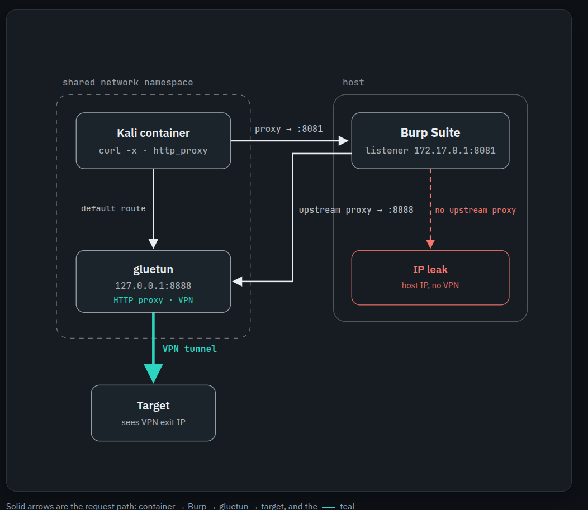
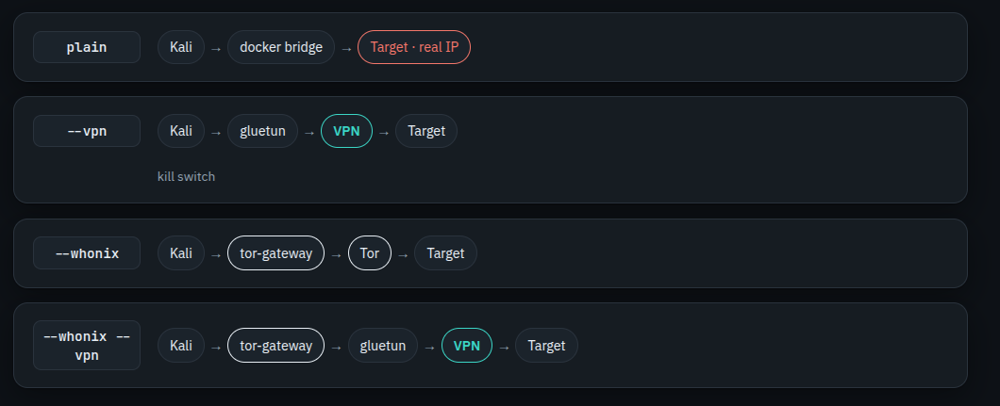
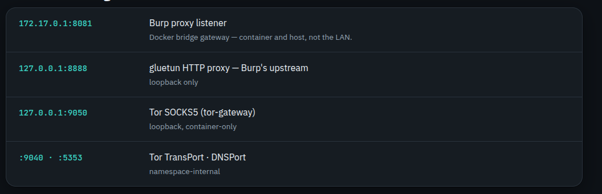

# pomdock

Disposable, network-isolated Kali pentest environments from one command — as a Docker
container or a libvirt VM, with all traffic forced through a VPN kill switch, Tor, or Tor
over VPN. Each engagement keeps its own loot directory, shell history, and recorded sessions.

> In active development and tuned to my own workflow. **Docker is the path I actually use;**
> the VM side works but sees less mileage.

## Install

```bash
cd cli && make build
make install            # PREFIX sets the location
make completion-zsh
```

Needs Go, Docker, and tmux. VMs also need libvirt and QEMU — list in [docs/vms.md](docs/vms.md).

## Use

```bash
pomdock                                          # TUI
pomdock docker exec --vpn ~/vpn/mullvad.conf     # Kali shell, all traffic via VPN
pomdock docker exec --whonix --name acme         # Tor-routed, named engagement
pomdock report                                   # browse recorded sessions
pomdock vm create kali                           # disposable Kali VM
```

```bash
pomdock docker exec [--vpn FILE] [--whonix] [--name NAME]
pomdock docker status | stop | rm | logs | burp [--name NAME]
pomdock vm create [name] [--profile PROFILE] [--iso PATH]
pomdock vm list | start | stop | ssh | rdp | console | reset | clone | delete NAME
pomdock report [--name NAME]
```

`exec` attaches if the container runs, restarts it if stopped, builds and creates it if
absent. `--name` gives an engagement its own container, loot dir at `~/pentest/NAME`, and
history, and remembers its route so it reconnects with just `exec --name NAME`.

## How traffic flows

The container shares the sidecar's network namespace, so every request leaves through the
tunnel. Run tools through Burp on the host to inspect them, and point Burp's upstream at
gluetun so they still exit via the VPN.



Egress by flag:



Ports and bindings:



## Docs

- [Docker](docs/docker.md)
- [VMs](docs/vms.md)
- [Sessions & reporting](docs/sessions.md)
- [TUI](docs/tui.md)
- [Testing](docs/testing.md)
